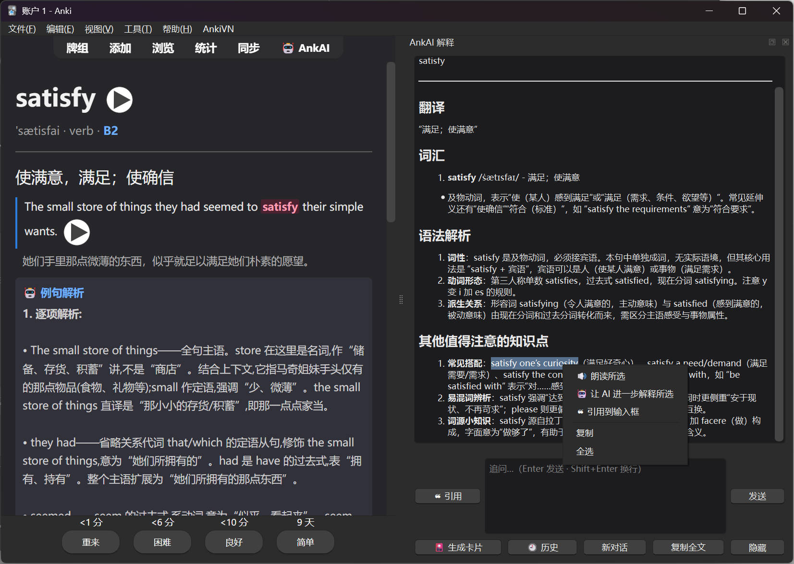
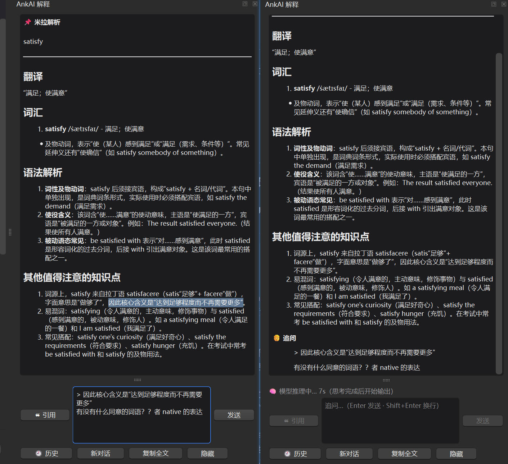
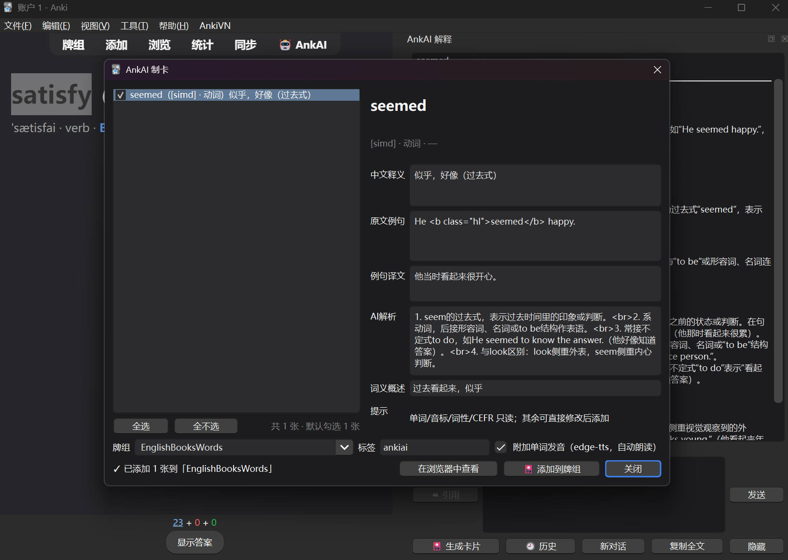

# AnkAI —— Anki 划选 AI 解释 + Edge TTS 朗读 + 会话制卡

[](https://github.com/Clov614/ankiai/releases)
[](ankiai/LICENSE)
[](https://apps.ankiweb.net)
[]()

在 Anki 复习界面**划选卡片任意文字 → 右键**，AI 即刻解析；解释结果在独立面板展示，可多轮追问，还能一键把会话提炼成单词卡。



## ✨ 功能

- 🤖 **AI 解释（米拉格式）**：翻译 / 词汇（带读音）/ 语法解析 / 其他值得注意的知识点
- 🧩 **AI 例句解析**：逐项解析 / 整句解读 / 文化点 / 记忆钩子
- 🔊 **朗读所选 / 朗读整卡**：免费 Edge TTS（微软语音，无需 key），按内容自动换声——英文默认英音，日文/中文/韩文/俄文自动切对应语音；300+ 音色在设置里下拉选择
- 💬 **多轮追问**：面板底部输入框像聊天一样继续问；划选面板内容可直接引用、朗读、让 AI 进一步解释
- 🕘 **解释历史**：每轮自动存档，可检索、可回溯继续追问、可导出 Markdown
- 🎴 **会话制卡**：点「🎴 生成卡片」，AI 自动把当前对话提炼成 EnWords 单词卡（单词/音标/词性/释义/CEFR/例句/AI解析/记忆钩子/发音），复选后写入任意牌组，重复词条自动跳过

快捷键：`Ctrl+Shift+A` 解释 · `Ctrl+Shift+S` 朗读 · `Ctrl+Shift+P` 面板显隐

## 🖼 截图预览

多轮追问——把面板里划选的内容引用到输入框，继续追问：



会话制卡——从解释会话里提炼单词卡，勾选后一键加入牌组：



## 📦 安装

要求 **Anki 25.09+**（Qt6）。

**方式一：GitHub Releases**（当前可用）

1. 从 [Releases](https://github.com/Clov614/ankiai/releases) 下载 `ankiai-x.y.z.ankiaddon`
2. 双击文件，或 Anki 里 工具 → 插件 → 从文件安装
3. 重启 Anki

**方式二：AnkiWeb**（审核通过后可用）

工具 → 插件 → 获取插件，输入插件代码。

## 🚀 使用

1. 复习卡片 → 划选文字 → 右键 → 选动作；未划选时可"朗读整卡"
2. AI 解释默认走本机 `claude` 命令（零配置）；想用 DeepSeek/Kimi 等，右键 → ⚙ 设置里切换"OpenAI 兼容 API"并填 key
3. API Key 只保存在本机插件配置里，不会随卡片或日志外发
4. **制卡**：解释面板有对话内容后点「🎴 生成卡片」→ AI 提炼候选 → 勾选（可改释义/例句/解析）→ 选牌组 → 添加

## 🔧 依赖

- TTS：系统 Python + `edge-tts`（首次朗读时插件会询问并自动安装）
- AI：三选一 —— 本机 claude CLI（默认）/ 任意 OpenAI 兼容端点（DeepSeek、Kimi、Ollama 等）/ Anthropic API

## 🗂 开发

插件源码与结构说明见 [ankiai/README.md](ankiai/README.md)。

```bash
python ankiai/deploy.py        # 部署到 Anki addons21
python tests/smoke_test.py     # 纯逻辑冒烟测试
python ankiai/package.py       # 打 .ankiaddon 发布包
```

## 📄 许可

[AGPL-3.0](ankiai/LICENSE)
